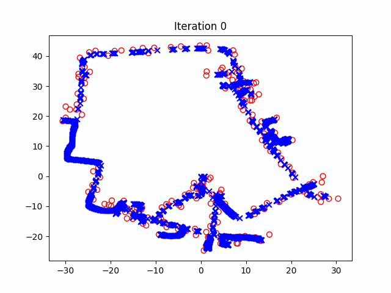

# SLAM

This repository follows the 2013/2014 course on SLAM by Cyrill Stachniss.

- Course link: http://ais.informatik.uni-freiburg.de/teaching/ws13/mapping/index_en.php
- Youtube link: https://www.youtube.com/playlist?list=PLgnQpQtFTOGQrZ4O5QzbIHgl3b1JHimN_

# Running Kalman Filter and its variants

- KF: `python -m src.FILTERS.KF.main` (does not produce plots)
- EKF: `python -m src.FILTERS.EKF.main`
- UKF: `python -m src.FILTERS.UKF.main`
- IF: `python -m src.FILTERS.IF.main` (does not produce plots)
- EIF: `python -m src.FILTERS.EIF.main`
- PF: `python -m src.FILTERS.PF.main`

# Running SLAM

- EKF SLAM: `python -m src.SLAM.EKF_SLAM.main`
- UKF SLAM: `python -m src.SLAM.UKF_SLAM.main`
- SEIF SLAM: `python -m src.SLAM.SEIF_SLAM.main` (does not work, there is an error, most likely in the measurement update)
- FAST SLAM: `python -m src.SLAM.FAST_SLAM.main`
- LSS SLAM: `python -m src.SLAM.LSS_SLAM.main`

# Results

<table>
  <tr>
    <td style="text-align: center;">
      
       
      <strong>EKF SLAM</strong>
    </td>
    <td style="text-align: center;">
      
       
      <strong>UKF SLAM</strong>
    </td>
  </tr>
  <tr>
    <td style="text-align: center;">
      
       
      <strong>FAST SLAM</strong>
    </td>
    <td style="text-align: center;">
      
       
      <strong>Least Squares SLAM</strong>
    </td>
  </tr>
</table>

# Output

The output robot trajectories after executing an algorithm will be found in `results`.